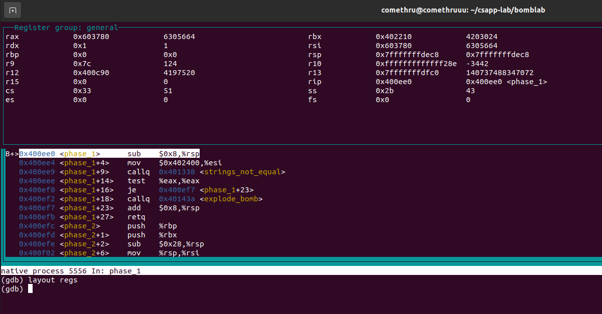
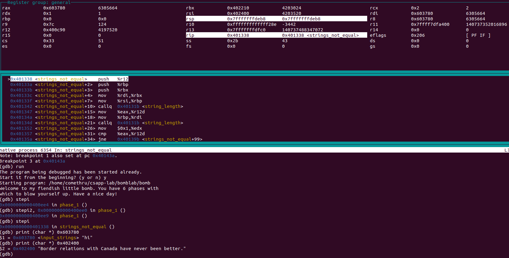
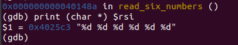
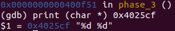
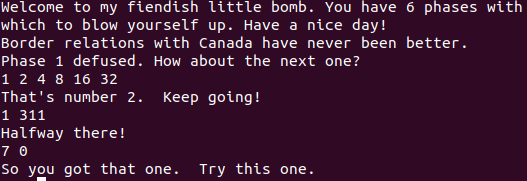

### 1. Overview

实验共有六个"bomb",需要通过反汇编可执行文件来找到六个"bomb"的密码,从而拆除炸弹,其中任何一个出错都会导致爆炸

### 2. GDB

为了找到拆除炸弹的密码,需要使用调试器(GDB)来反汇编二进制文件并单步执行每个阶段的机器码,通过了解每一步汇编语句的作用来反推密码

gdb操作手册: [gdbnotes](http://csapp.cs.cmu.edu/2e/docs/gdbnotes-x86-64.pdf)

实验中常用的gdb调试指令:
```
$ gdb [file] - 指定要调试的可执行文件

$ run - 运行程序
$ kill - 停止程序运行

$ break phase_1 - 在函数phase_1入口处设置断点
$ break *0x80483c - 在地址0x80483c处设置断点
$ delete x - 删除断点x

$ stepi - 执行1条指令
$ stepi 4 - 执行4条指令
$ nexti - 类似于stepi,但执行到函数时不会进入函数

$ print /(x,d,t) $rax - 以指定格式打印寄存器中的内容
$ print (char *) 0xbfff890 - 以string形式打印地址0xbfff890中的内容

$ x/<n/f/u> <addr> - 查看内存地址addr中的值
n,f,u是可选的参数,分别表示内存单元个数,显示格式,从当前地址开始查看的字节数

$ layout asm - 显示汇编窗口
$ layout regs - 显示寄存器窗口
```



### 3. Defuse Bomb

#### 3.1 phase_1

```
0000000000400da0 <main>:
    400e2d:	e8 de fc ff ff       	callq  400b10 <puts@plt>
    400e32:	e8 67 06 00 00       	callq  40149e <read_line>
    400e37:	48 89 c7             	mov    %rax,%rdi
    400e3a:	e8 a1 00 00 00       	callq  400ee0 <phase_1>

0000000000400ee0 <phase_1>:
  400ee0:	48 83 ec 08          	sub    $0x8,%rsp
  400ee4:	be 00 24 40 00       	mov    $0x402400,%esi
  400ee9:	e8 4a 04 00 00       	callq  401338 <strings_not_equal>
  400eee:	85 c0                	test   %eax,%eax
  400ef0:	74 05                	je     400ef7 <phase_1+0x17>
  400ef2:	e8 43 05 00 00       	callq  40143a <explode_bomb>
  400ef7:	48 83 c4 08          	add    $0x8,%rsp
  400efb:	c3                   	retq   
```

main()函数将输入字符串加载到%rdi中作为参数调用phase_1(),而phase_1()中将地址0x402400中的数据加载到%rsi中作为函数strings_not_equal()的参数,strings_not_equal()函数用于比较两个字符串是否相等,显然地址0x402400中的数据即为正确的密码

通过指令`$ print (char *) 0x402400`即可找到正确密码:



#### 3.2 phase_2

```
0000000000400efc <phase_2>:
  400efc:	55                   	push   %rbp
  400efd:	53                   	push   %rbx
  400efe:	48 83 ec 28          	sub    $0x28,%rsp
  400f02:	48 89 e6             	mov    %rsp,%rsi
  400f05:	e8 52 05 00 00       	callq  40145c <read_six_numbers>
  400f0a:	83 3c 24 01          	cmpl   $0x1,(%rsp)
  400f0e:	74 20                	je     400f30 <phase_2+0x34>
  400f10:	e8 25 05 00 00       	callq  40143a <explode_bomb>
  400f15:	eb 19                	jmp    400f30 <phase_2+0x34>
  400f17:	8b 43 fc             	mov    -0x4(%rbx),%eax
  400f1a:	01 c0                	add    %eax,%eax
  400f1c:	39 03                	cmp    %eax,(%rbx)
  400f1e:	74 05                	je     400f25 <phase_2+0x29>
  400f20:	e8 15 05 00 00       	callq  40143a <explode_bomb>
  400f25:	48 83 c3 04          	add    $0x4,%rbx
  400f29:	48 39 eb             	cmp    %rbp,%rbx
  400f2c:	75 e9                	jne    400f17 <phase_2+0x1b>
  400f2e:	eb 0c                	jmp    400f3c <phase_2+0x40>
  400f30:	48 8d 5c 24 04       	lea    0x4(%rsp),%rbx
  400f35:	48 8d 6c 24 18       	lea    0x18(%rsp),%rbp
  400f3a:	eb db                	jmp    400f17 <phase_2+0x1b>
  400f3c:	48 83 c4 28          	add    $0x28,%rsp
  400f40:	5b                   	pop    %rbx
  400f41:	5d                   	pop    %rbp
  400f42:	c3                   	retq
```

一开始调用read_six_numbers()函数读取输入字符串,然后调用sscanf()函数按照指定格式(下图)匹配字符串中的数字,匹配得到的数字存放在int数组中,数组长度大于5则返回true



随后从第二位数字开始for循环遍历数组,如果是前一位数字的2倍,则继续循环,否则boom,任务失败,因此可以推算密码是一个公比为2的等比数列,且长度大于5;

```
  400f17:	8b 43 fc             	mov    -0x4(%rbx),%eax
  400f1a:	01 c0                	add    %eax,%eax 
  400f1c:	39 03                	cmp    %eax,(%rbx)
  400f1e:	74 05                	je     400f25 <phase_2+0x29>
  400f20:	e8 15 05 00 00       	callq  40143a <explode_bomb>
```

这里比较了栈顶元素(第一个数字)和0x1,因此可以确定第一位数字是1,因此得出正确密码为 "1 2 4 8 16 32 ..."

```
  400f0a:	83 3c 24 01          	cmpl   $0x1,(%rsp)
  400f0e:	74 20                	je     400f30 <phase_2+0x34>
  400f10:	e8 25 05 00 00       	callq  40143a <explode_bomb>
```

#### 3.3 phase_3


代码较多,部分截取,只贴关键部分

```
<part1>

  400f51:	be cf 25 40 00       	mov    $0x4025cf,%esi
  400f56:	b8 00 00 00 00       	mov    $0x0,%eax
  400f5b:	e8 90 fc ff ff       	callq  400bf0 <__isoc99_sscanf@plt>
  400f60:	83 f8 01             	cmp    $0x1,%eax
  400f63:	7f 05                	jg     400f6a <phase_3+0x27>
  400f65:	e8 d0 04 00 00       	callq  40143a <explode_bomb>

<part2>

  400f6a:	83 7c 24 08 07       	cmpl   $0x7,0x8(%rsp)
  400f6f:	77 3c                	ja     400fad <phase_3+0x6a>
  400f71:	8b 44 24 08          	mov    0x8(%rsp),%eax
  400f75:	ff 24 c5 70 24 40 00 	jmpq   *0x402470(,%rax,8)

<part3>

  400f7c:	b8 cf 00 00 00       	mov    $0xcf,%eax
  400f81:	eb 3b                	jmp    400fbe <phase_3+0x7b>
  400f83:	b8 c3 02 00 00       	mov    $0x2c3,%eax
  400f88:	eb 34                	jmp    400fbe <phase_3+0x7b>
  400f8a:	b8 00 01 00 00       	mov    $0x100,%eax
  400f8f:	eb 2d                	jmp    400fbe <phase_3+0x7b>
  400f91:	b8 85 01 00 00       	mov    $0x185,%eax
  400f96:	eb 26                	jmp    400fbe <phase_3+0x7b>
  400f98:	b8 ce 00 00 00       	mov    $0xce,%eax
  400f9d:	eb 1f                	jmp    400fbe <phase_3+0x7b>
  400f9f:	b8 aa 02 00 00       	mov    $0x2aa,%eax
  400fa4:	eb 18                	jmp    400fbe <phase_3+0x7b>
  400fa6:	b8 47 01 00 00       	mov    $0x147,%eax
  400fab:	eb 11                	jmp    400fbe <phase_3+0x7b>

<part4>

  400fbe:	3b 44 24 0c          	cmp    0xc(%rsp),%eax
  400fc2:	74 05                	je     400fc9 <phase_3+0x86>
  400fc4:	e8 71 04 00 00       	callq  40143a <explode_bomb>
```

part1: 和phase_2一样,获取字符串输入,按照指定格式匹配字符串中的数字并返回



part2: 将输入的第一个数字与0x7比较,若大于7则爆炸,小于等于7(无符号数大于0)则进入一个switch结构,第一个数字作为switch的索引

part3: * (0x402470 + 4*%rax)转为16进制即为索引0-7对应的地址, 跳转后每个分支都会将一个常数赋给%eax,然后跳转到地址0x400fbe

part4: 最后将part3赋给%eax的常数与输入的第二个数字相对比,相等则结束,否则爆炸

由于第一个数字的取值范围是[1,7],因此1-7各有一个对应的常数,以下组合均为正确密码:
0 - 207, 1 - 311, 2 - 707, 3 - 256, 4 - 389, 5 - 206, 6 - 682, 7 - 327

#### 3.4 phase_4

```
000000000040100c <phase_4>:

  40101a:	be cf 25 40 00       	mov    $0x4025cf,%esi
  40101f:	b8 00 00 00 00       	mov    $0x0,%eax
  401024:	e8 c7 fb ff ff       	callq  400bf0 <__isoc99_sscanf@plt>
  401029:	83 f8 02             	cmp    $0x2,%eax
  40102c:	75 07                	jne    401035 <phase_4+0x29>

  40102e:	83 7c 24 08 0e       	cmpl   $0xe,0x8(%rsp)
  401033:	76 05                	jbe    40103a <phase_4+0x2e>
  401035:	e8 00 04 00 00       	callq  40143a <explode_bomb>

  40103a:	ba 0e 00 00 00       	mov    $0xe,%edx
  40103f:	be 00 00 00 00       	mov    $0x0,%esi
  401044:	8b 7c 24 08          	mov    0x8(%rsp),%edi
  401048:	e8 81 ff ff ff       	callq  400fce <func4>
  40104d:	85 c0                	test   %eax,%eax
  40104f:	75 07                	jne    401058 <phase_4+0x4c>

  401051:	83 7c 24 0c 00       	cmpl   $0x0,0xc(%rsp)
  401056:	74 05                	je     40105d <phase_4+0x51>
  401058:	e8 dd 03 00 00       	callq  40143a <explode_bomb>
  40105d:	48 83 c4 18          	add    $0x18,%rsp
  401061:	c3                   	retq 
```

读取输入的两个数,第一个数作为参数存入%edi(要求小于等于14),另外0xe和0x0作为第二个和第三个参数来调用函数func4,返回值%eax为0,根据`cmpl $0x0,0xc(%rsp)`可知,第二个输入的数字应为0

函数func4可简化为如下逻辑:

```
def func(a, c, d):
    b = d < c ? (d+c+1)/2 : (d+c)/2
    if b < a:
        return func(a, b+d, d)*2 + 1
    else if b > a:
        return func(a, c, b-1)*2
    else:
        return 0
```

此时若函数返回值为0,则是a==b的情况,从而a=b=(d+c)/2=7,因此输入的第一个数应为7!(即7,3,2,1),输入的第二个数为0!

