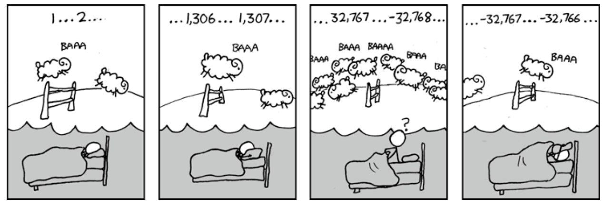

### 1. Overview

实验目的是通过一系列编程题目，考察对位操作符的使用以及整数和单精度浮点数的位级的表示，从而加深对计算机中数据的理解

### 2. Instuction

#### 2.1 INTEGER CODING RULES:

**2.1.1 Expression(表达式) Rule:**

1. Integer constants 0 through 255 (0xFF), inclusive. You are not allowed to use big constants such as 0xffffffff.
2. Only function arguments and local variables (no global variables).
3. Unary integer operations ! ~
4. Binary integer operations & ^ | + << >>

**2.1.2 You are expressly forbidden to:**
  1. Use any control constructs such as if, do, while, for, switch, etc.
  2. Define or use any macros(宏).
  3. Define any additional functions in this file.
  4. Call any functions.
  5. Use any other operations, such as &&, ||, -, or ?:
  6. Use any form of casting.
  7. Use any data type other than int.  This implies that you cannot use arrays, structs, or unions.

#### 2.2 FLOATING POINT CODING RULES

**2.2.1 Expression(表达式) Rule:**

For the problems that require you to implement floating-point operations, the coding rules are less strict.  You are allowed to use **looping and conditional control**.  You are allowed to use **both ints and unsigneds**. You can use **arbitrary integer and unsigned constants**. You can use **any arithmetic, logical, or comparison operations** on int or unsigned data.

**2.2.2 You are expressly forbidden to:**

  1. Define or use any macros(宏).
  2. Define any additional functions in this file.
  3. Call any functions.
  4. Use any form of casting.
  5. Use any data type other than int or unsigned.  This means that you cannot use arrays, structs, or unions.
  6. Use any floating point data types, operations, or constants.

### 3. Questions

**3.1 bitXor**

```
/* 
 * bitXor - x^y using only ~ and & 
 *   Example: bitXor(4, 5) = 1
 *   Legal ops: ~ &
 *   Max ops: 14
 *   Rating: 1
 */
int bitXor(int x, int y) {
  return (~(x & y)) & (~((~x) & (~y)));
}
```
参考摩尔根定理：~ (~x & ~y) == x | y

**3.2 tmin**

```
/* 
 * tmin - return minimum two's complement integer 
 *   Legal ops: ! ~ & ^ | + << >>
 *   Max ops: 4
 *   Rating: 1
 */
int tmin(void) {
  return 1<<31; 
}
```
32位有符号数最小值 <==> 符号位为1，其余为0

**3.3 isTmax**

```
/*
 * isTmax - returns 1 if x is the maximum, two's complement number,
 *     and 0 otherwise 
 *   Legal ops: ! ~ & ^ | +
 *   Max ops: 10
 *   Rating: 1
 */
int isTmax(int x) {
  return !(x + 1 + x + 1) & !!(x+1);
}
```
INT_MIN = -INT_MAX-1 <==> INT_MIN + INT_MAX + 1 = 0
其中INT_MIN = INT_MAX+1
x+1是针对x=-1的情况

**3.4 allOddBits**

```
/* 
 * allOddBits - return 1 if all odd-numbered bits in word set to 1
 *   where bits are numbered from 0 (least significant) to 31 (most significant)
 *   Examples allOddBits(0xFFFFFFFD) = 0, allOddBits(0xAAAAAAAA) = 1
 *   Legal ops: ! ~ & ^ | + << >>
 *   Max ops: 12
 *   Rating: 2
 */
int allOddBits(int x) {

  int temp = 0xAA;
  temp = (temp << 8) + 0xAA;
  temp = (temp << 8) + 0xAA;
  temp = (temp << 8) + 0xAA;
  return !((x & temp) ^ temp);

}
```
判断x的奇数位是否都置为1,不难发现A是一个奇数位都是1，偶数位都是0的数字（位从0记起）,因此只需将x与0xAAAAAAAA取交集即可判断是否奇数位全为1.

而由于数字大小的限制(0-255)，取temp=0xAA，通过三次移位得到0xAAAAAAAA,若x的奇数位全为1，则x&temp=0xAAAAAAAA=temp，取异或为0，取反为1

**3.5 negate**

```
/* 
 * negate - return -x 
 *   Example: negate(1) = -1.
 *   Legal ops: ! ~ & ^ | + << >>
 *   Max ops: 5
 *   Rating: 2
 */
int negate(int x) {
  return (~x) + 1;
}
```
补码加法: x + (~x) + 1 = 0 -> -x = (~x) + 1, 补码加法溢出的位会被截断

**3.6 isAsciiDigit**

```
/* 
 * isAsciiDigit - return 1 if 0x30 <= x <= 0x39 (ASCII codes for characters '0' to '9')
 *   Example: isAsciiDigit(0x35) = 1.
 *            isAsciiDigit(0x3a) = 0.
 *            isAsciiDigit(0x05) = 0.
 *   Legal ops: ! ~ & ^ | + << >>
 *   Max ops: 15
 *   Rating: 3
 */
int isAsciiDigit(int x) {

  int a = !((x >> 4) ^ 0x3); // 判断前四位是否等于3
  int b = x & 0xf; // 提取x的后四位
  int c = ~0xA + 1; // ～OxA+1 = 0xFFFFFFF6(0110)
  // int d = 0x80 << 8; // 0x8000 ? 
  int e = !!((b+c)&0x80); // 若x的后四位大于9,则b+c必会溢出且等于0,则(b+c)&d为0,e=0,否则为1
  return a & e;

}
```
大致思路是把前四位和后四位分开处理,若0x30 <= x <= 0x39,则x的前四位一定等于0x3,再提取x的后四位,判断是否有0 <= x <= 9;最后两个判断的结果取交集

**3.7 conditional**

```
/* 
 * conditional - same as x ? y : z 
 *   Example: conditional(2,4,5) = 4
 *   Legal ops: ! ~ & ^ | + << >>
 *   Max ops: 16
 *   Rating: 3
 */
int conditional(int x, int y, int z) {
  
  // return y + z + ((~(!x) + 1) & ((~y) + 1)) + ((~(!!x) + 1) & ((~z) + 1)) ;

  int a = !!(x^0x0); // x==0 -> a=1  x!=0 -> a=0
  int b = ~a+1; // x==0 -> b=0xFFFFFFFF  x!=0 -> b=0
  int c = ~(y&~b)+1; // x==0 -> ~b=0 -> ~(y&~b)=0xFFFFFFFF -> +1=0
  int d = ~(z&b)+1; // x==0 -> b=0xFFFFFFFF -> ~(z&b)=~z -> +1=~z+1
  return y+z+c+d;
  
}

```
x != 0 时返回y, x == 0 时返回z
即x!=0时,表达式中含z的部分为0,即z+(~z)+1=0, 而x == 0时,有y+(~y)+1=0
从而需要使x&(~y+1)表达式中x在x!=0时为0x0,在x==0时为0xFFFFFFFF,对于z同理

**3.8 isLessOrEqual**

```
/* 
 * isLessOrEqual - if x <= y  then return 1, else return 0 
 *   Example: isLessOrEqual(4,5) = 1.
 *   Legal ops: ! ~ & ^ | + << >>
 *   Max ops: 24
 *   Rating: 3
 */
int isLessOrEqual(int x, int y) {

  int a = x>>31&0x1; // 获取x的符号位
  int b = y>>31&0x1; // 获取y的符号位
  int c1 = (a&~b); // x<0,y>0时,c1=1
  int c2 = (~a&b); // x>0,y<0时,c2=1
  int c = y + (~x) + 1; // y-x
  int flag = c>>31; // y-x的符号位
  return c1 | (!c2 & !flag) ;

}
```
需要考虑极端情况下的溢出情况
当x<0,y>0(INT_MAX)时,y+(-x)<0,此时c1=1,c2=0,flag=1,满足x<=y
当x>0,y<0(INT_MIN)时,y+(-x)>0,此时c1=0,c2=1,flag=0,不满足x<=y

**3.9 logicalNeg**

```
/* 
 * logicalNeg - implement the ! operator, using all of 
 *              the legal operators except !
 *   Examples: logicalNeg(3) = 0, logicalNeg(0) = 1
 *   Legal ops: ~ & ^ | + << >>
 *   Max ops: 12
 *   Rating: 4 
 */
int logicalNeg(int x) {
  return ((x | (~x+1)) >> 31) + 1;
}
```
要点在于如何判断x!=0
x=0->～x+1=0  x!=0 -> ~x+1!=0
x | ~x+1 -> x=0时为0x00000000  x!=0时为0xffffffff
右移31位, >>31 -> x=0时为0  x!=0时为-1

**3.10 howManyBits**

```
/* howManyBits - return the minimum number of bits required to represent x in
 *             two's complement
 *  Examples: howManyBits(12) = 5
 *            howManyBits(298) = 10
 *            howManyBits(-5) = 4
 *            howManyBits(0)  = 1
 *            howManyBits(-1) = 1
 *            howManyBits(0x80000000) = 32
 *  Legal ops: ! ~ & ^ | + << >>
 *  Max ops: 90
 *  Rating: 4
 */
int howManyBits(int x) {
  
  int b16, b8, b4, b2, b1, b0;
  int flag = x>>31;
  x = (~x&flag)^(~flag&x);
  b16 = !!(x>>16) << 4;
  x >>= b16;

  b8 = !!(x>>8) << 3;
  x >>= b8;

  b4 = !!(x>>4) << 2;
  x >>= b4;

  b2 = !!(x>>2) << 1;
  x >>= b2;

  b1 = !!(x>>1);
  x >>= b1;
  b0 = x;

  return b16+b8+b4+b2+b1+b0+1;

}
```
思路:从右往左找到最左边1的位置,加上一位符号位即可
1.获取x符号位判断x>=0或x<0(x为负不方便右移计算)
2.若x>=0则保持不变,x<0则按位取反
3.判断高16位是否为0(x>>16),若不为0则b16=16(至少有17位)
4.高16位不为0,则x右移16位,左边补0,x>>=b16
5.判断高8位是否为0(x>>8)......以此类推,最后全部相加再加1(符号位)

**3.11 floatScale2**

```
/* 
 * floatScale2 - Return bit-level equivalent of expression 2*f for
 *   floating point argument f.
 *   Both the argument and result are passed as unsigned int's, but
 *   they are to be interpreted as the bit-level representation of
 *   single-precision floating point values.
 *   When argument is NaN, return argument
 *   Legal ops: Any integer/unsigned operations incl. ||, &&. also if, while
 *   Max ops: 30
 *   Rating: 4
 */
unsigned floatScale2(unsigned uf) {

  int exp = (uf&0x7f800000) >> 23;
  int sign = uf>>31&0x1;
  int frac = uf&0x7fffff;
  int result;

  if(!(exp ^ 0xff)){ // exp域全为1,frac为0时是无穷大,frac!=0时是NaN,均返回argument

    result = uf;
    
  } else if(!exp){ // exp域全为0,非规格化值

    frac <<= 1;
    result = sign<<31 | exp<<23 | frac;

  } else { // exp不全为0且不全为1,规格化值
    
    exp++;
    result = sign<<31 | exp<<23 | frac;

  }
  return result;
}
```

后面的还没做,空了再做

**3.12 floatFloat2Int**

```
/* 
 * floatFloat2Int - Return bit-level equivalent of expression (int) f
 *   for floating point argument f.
 *   Argument is passed as unsigned int, but
 *   it is to be interpreted as the bit-level representation of a
 *   single-precision floating point value.
 *   Anything out of range (including NaN and infinity) should return
 *   0x80000000u.
 *   Legal ops: Any integer/unsigned operations incl. ||, &&. also if, while
 *   Max ops: 30
 *   Rating: 4
 */
int floatFloat2Int(unsigned uf) {
  return 2;
}
```

**3.13 floatPower2**

```
/* 
 * floatPower2 - Return bit-level equivalent of the expression 2.0^x
 *   (2.0 raised to the power x) for any 32-bit integer x.
 *
 *   The unsigned value that is returned should have the identical bit
 *   representation as the single-precision floating-point number 2.0^x.
 *   If the result is too small to be represented as a denorm, return
 *   0. If too large, return +INF.
 * 
 *   Legal ops: Any integer/unsigned operations incl. ||, &&. Also if, while 
 *   Max ops: 30 
 *   Rating: 4
 */
unsigned floatPower2(int x) {
    return 2;
}
```